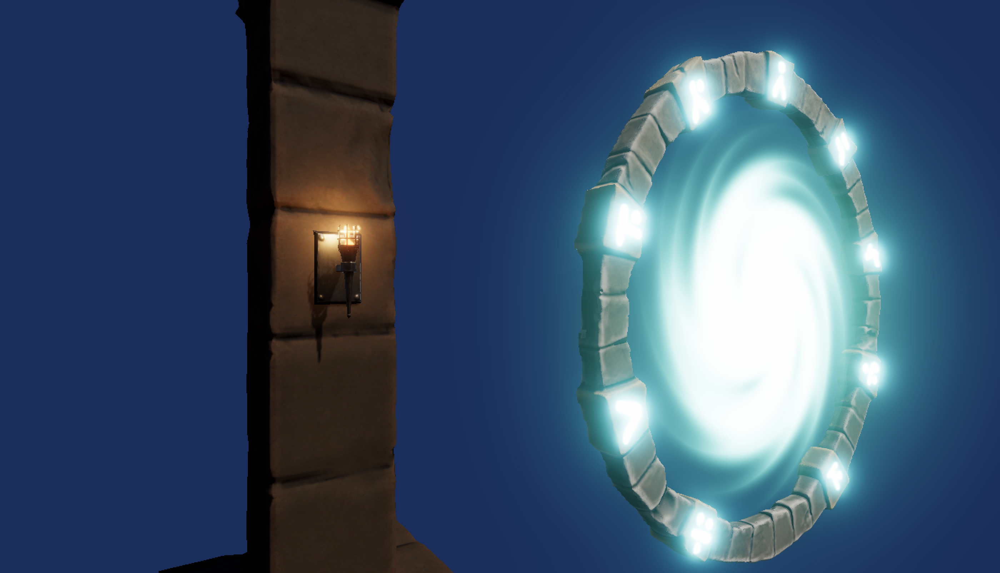

# Unity Shader Graph Workshop

This repository contains the Unity project and workshop slides for the ACM VR Jam 2025.

## Introduction 
The workshop contains two parts:
* An introductory swirly portal effect applied to the interior of a stargate mesh.
* Creating a RIME inspired stylized fire based on the presentation by Simon Trümpler ([link](https://www.unrealengine.com/en-US/events/unreal-fest-europe-2018/stylized-vfx-in-rime)).

The project uses Unity 6 (6000.0.32f) with the Universal Render Pipeline. The `Portal` and `Fire` scenes are the intended entry point and contain starter objects for working with the shader graphs, a directional light, and minimal post-processing (Bloom and Tonemapping).
The `Finished` scene contains both finished effects and several 3D models to demonstrate their usage.

Some familiarity with Unity is useful, specifically basic knowledge of Materials, creating objects, interface navigation, and a minimal Shader Graph introduction. This is mainly because I do not show every step in the presentation slides.

## Organization 
The root repo is a Unity project that can be directly opened.
The presentation slides are located in `SGWorkshop.pdf`.
Within the project itself, there are RGBA textures for use in the shaders. For the stargate, pillar, and sconce meshes, I have already set up and applied appropriate materials.

***Completed Materials***  
The `Finished` folders in `Shaders` and `Materials` contain the completed versions of the shaders created throughout the workshop.
